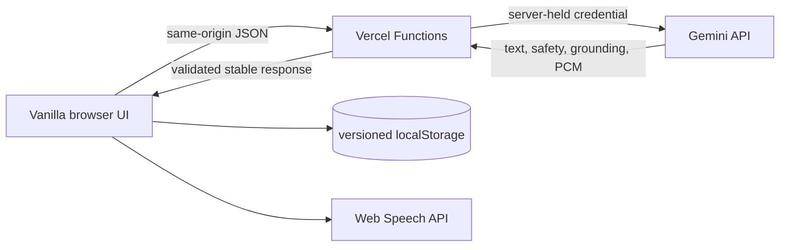

# MMCOE Vector ordered repair plan

Baseline: `master` at `ec108647c202ea38007e27a7cd4ec87b37192376`  
Implementation branch prepared: `fix/mmcoe-chatbot-reliability`  
Planning date: 2026-09-07

## Proposed smallest maintainable architecture

Keep MMCOE Vector as a vanilla HTML/CSS/JavaScript application. Do not introduce React, Next.js, a database, accounts, or a new paid service.

Add a small, reproducible Node-based toolchain only where it earns its keep:

- A pinned package manifest/lockfile and a lightweight bundler (for example Vite) to bundle local vanilla-JS modules, Tailwind output if retained, `marked`, and DOMPurify. This removes runtime CDN dependencies and permits tests without adopting a UI framework.
- A small set of Vercel Node Functions: `/api/chat`, `/api/translate`, and `/api/tts`, sharing validation, Gemini REST handling, stable error mapping, abort/deadline logic, and configuration. The Gemini credential exists only as `process.env.GEMINI_API_KEY` inside Functions.
- Client modules by responsibility: app/controller, API client, rendering, conversation/history store, translation/audio, speech recognition, theme, and accessibility/DOM wiring.
- Versioned browser-local conversation/history storage only. No server-side transcript database is proposed.
- Automated unit/DOM/contract tests plus a small Playwright browser suite and CI.

Why this is appropriate: it fixes the security boundary, keeps Vercel and Gemini, preserves the current product surface, supports testable modules, and avoids paying the complexity cost of a large framework for a single-page interface.

## A. Secure backend, credential handling, safe rendering, and dependency foundations

Confirmed problems to fix: M-001 through M-008, M-015/M-017 foundations, M-030/M-031, and M-036.

Proposed implementation:

1. Immediately revoke the exposed key outside the repository; treat Git history and deployed copies as compromised. Never paste the replacement into chat.
2. Add Vercel Functions with a shared Gemini REST client. Store the replacement in `GEMINI_API_KEY` for Development/Preview/Production as appropriate. Reject unsupported methods/content types, validate JSON and input lengths, cap output, apply deadlines, and return stable public error codes.
3. Make browser requests same-origin. Add origin/request-size controls and plan practical Vercel firewall/rate rules without a database.
4. Replace all string-built untrusted HTML with safe DOM construction. Preserve Markdown by always passing output through pinned `marked` + DOMPurify with a strict allowlist; if parsing/sanitization fails, use `textContent`. Validate source links as `https:` and add `rel="noopener noreferrer"`.
5. Remove the v0 development bridge and missing runtime reference.
6. Pin and bundle dependencies with a lockfile. Produce deterministic `dev`, `build`, `test`, and `preview` scripts. Add baseline CSP/security headers compatible with the resulting same-origin design.

Dependencies: none; this stage is the gate for all API-backed work.

Tests and acceptance criteria:

- Secret scan finds no credential in current sources or built assets; browser network contains no Google credential/direct Gemini request.
- Harmless rendering fixtures remain inert when sanitizer/parser imports fail.
- API boundary tests cover invalid JSON, oversized input, wrong method, upstream 401/403/429/5xx/timeout, and stable redacted errors.
- Clean install/build is reproducible; no startup 404 or Tailwind production warning; CSP/header tests pass.

External/manual requirements: Google owner revokes/replaces/restricts the key and confirms API/billing/quota; Vercel owner configures environment variables and any firewall/rate rules. Preview header behavior requires a deployed preview later.

Behavior risk: stricter rendering may change some Markdown appearance; request limits may reject unusually long prompts. Preserve documented limits and provide clear UI feedback.

## B. Request coordination, cancellation, conversation state, and history

Confirmed problems to fix: M-012 through M-014 and M-018 through M-020; interaction overlap from M-023.

Proposed implementation:

1. Introduce one request coordinator with request IDs and separate abort scopes for chat, translation, and audio. Superseded work cannot update current DOM state.
2. Apply a total request deadline and bounded retry policy only to eligible transient failures; respect `Retry-After` and abort immediately on user cancellation/navigation.
3. Represent a conversation as ordered user/model turns. Send only the current conversation's bounded recent context, with an explicit new-chat/reset action. Do not send unrelated stored history.
4. Define a versioned local-storage schema, validate/migrate reads, handle parse/quota/private-mode failures, and retain at most the documented limit.
5. Rebuild history with stable DOM structure and event listeners. Fix list/detail/back focus restoration and stop delete events from navigating. Keep destructive clear confirmation.

Dependencies: A's safe DOM/API contracts.

Tests and acceptance criteria:

- Delayed mocked responses prove cancellation and stale-response suppression.
- Two-turn test shows the second request includes the relevant first turn; new chat excludes it.
- Corrupt/legacy/quota storage fixtures do not crash startup.
- History list/detail/back/delete/clear and 50-entry trimming pass keyboard and browser tests.
- Loading controls remain internally consistent across abort, retry, error, and success.

External/manual requirements: none for mocked tests; a valid Gemini configuration is needed for a real semantic follow-up check.

Behavior risk: bounded context can change model answers compared with stateless requests and can send more prior conversation text to Google. Explain this in privacy copy and cap it tightly.

## C. Translation and audio

Confirmed problems to fix: M-009, M-010, and M-033 plus current auth/API boundary failures.

Proposed implementation:

1. Route translation through `/api/translate`; use schema-supported fields only and place target language in validated server-side instructions. Cache translation per message/language in memory for the session to avoid duplicate calls.
2. Route TTS through `/api/tts`; use the documented configurable model `gemini-2.5-flash-preview-tts` while it remains supported, `responseModalities: ["AUDIO"]`, a validated voice, and documented language codes.
3. Validate MIME/rate/audio length server-side and client-side. Keep PCM-to-WAV conversion covered by byte-level tests.
4. Maintain one audio controller: play/pause/stop, abort generation, stop previous playback, handle rejected `play()`, revoke every object URL, and restore controls deterministically.
5. Speak the already displayed translation when available rather than translating the same content again.

Dependencies: A API boundary; B cancellation coordination.

Tests and acceptance criteria:

- Request/response contract fixtures for English/Hindi/Marathi, malformed candidates, unsupported languages, and missing audio.
- Byte-level WAV header/sample tests.
- UI translation show/hide and repeat-click tests.
- Exactly one active audio element/request; cancellation and autoplay rejection are visible and leak-free.
- Real external checks produce intelligible English, Hindi, and Marathi audio and accurate visual translations, with human review for language quality.

External/manual requirements: enabled Gemini translation/chat access and preview TTS access/quota; speakers/headphones and Hindi/Marathi reviewers.

Behavior risk: preview TTS model availability can change; keep the model server-configurable and surface graceful unavailability. Translation wording may differ from current model output.

## D. Microphone lifecycle

Confirmed problems to fix: M-021 through M-023.

Proposed implementation:

1. Use an explicit finite-state controller (`unsupported`, `idle`, `requesting`, `listening`, `stopping`, `error`) with a durable `userWantsListening` flag.
2. Avoid a redundant `getUserMedia()` stream when Web Speech can request permission itself, or immediately stop every track if a preflight stream is retained.
3. Never auto-restart after explicit stop, permission denial, page hide, unload, or request start. Limit recovery restarts and make them visible.
4. Do not auto-submit a final transcript without a clearly documented/visible choice; default to placing text in the input for review.
5. Separate interim transcript UI from the placeholder and announce state accessibly.

Dependencies: B request/state coordinator and F accessibility primitives (implementation can begin earlier; final acceptance follows F).

Tests and acceptance criteria:

- Mock Web Speech/MediaStream event sequences prove one start, one stop, all tracks released, no restart after user stop, and cleanup on hide/unload.
- Permission-denied/unsupported/network/no-speech/aborted states settle to a deterministic UI.
- Sending a question cannot leave recognition unexpectedly active.
- Manual browser/device microphone indicator turns off after every stop/error/navigation case.

External/manual requirements: explicit consented testing on Chrome/Edge desktop and at least Android Chrome; Safari/Firefox should show truthful unsupported/fallback behavior. Do not claim device validation from mocks.

Behavior risk: removing auto-submit/continuous restart slightly changes the current hands-free behavior but materially improves consent and predictability.

## E. Answer reliability, citations, prompts, and moderation

Confirmed problems to fix: M-011, M-015/M-016, M-027/M-028, and output-limit portions of M-031.

Proposed implementation:

1. Rewrite the system prompt to state only implemented capabilities, include a review date, distinguish stable MMCOE identity from volatile admissions facts, and require uncertainty instead of fabricated guarantees.
2. Move maintained MMCOE facts into a small, cited data module with source URL, owner/reviewer, and reviewed date. Remove or qualify unsupported percentage/quota claims until an authoritative current source is verified.
3. Parse current `groundingChunks` and `groundingSupports`, attach citations to supported claims, de-duplicate sources, validate URLs, and label ungrounded volatile claims. Prefer official MMCOE/CET Cell/NTA domains for relevant claims; do not present search as institution-controlled RAG.
4. Use Gemini safety settings/provider finish reasons plus a focused, documented multilingual institutional policy. Avoid relying solely on a free-form `CLEAN` prompt; define safe fallback behavior and do not leak blocked content.
5. Test scope handling, emergency/ragging guidance, fees/admissions/date questions, ambiguity, Hinglish/Marathi/Hindi, prompt injection, unsupported Maps/document claims, and citation-to-claim mapping.

Dependencies: A server boundary and B conversation model.

Tests and acceptance criteria:

- Current official questions contain working citations and visible reviewed/current context.
- Mocked grounding tests map support indices to the correct links and reject malformed/non-HTTPS metadata.
- A domain-reviewed golden set meets agreed factuality/scope criteria; uncertain facts are clearly qualified.
- Multilingual moderation fixtures are consistent, fail safely, and do not block benign academic content excessively.
- Prompt no longer claims document upload, Maps access, training, guaranteed currentness, or nonexistent pages/features.

External/manual requirements: MMCOE content owner confirms facts/contacts/approved sources; Google project must enable the needed model/search behavior; policy owner reviews moderation and ragging/emergency copy.

Behavior risk: answers may become more cautious, shorter, or refuse unsupported claims; official-domain preference can reduce coverage. This is intentional but should be evaluated with student scenarios.

## F. Responsive interface, accessibility, themes, and loading behavior

Confirmed problems to fix: M-024 through M-026, M-034/M-035, and loading-state UX.

Proposed implementation:

1. Use a mobile-first single-column layout with collapsible capability/history areas, then a two-column desktop breakpoint. Prefer dynamic viewport units with safe fallbacks and avoid page-level horizontal scrolling.
2. Move history outside the welcome bubble; use one H1 and a logical heading hierarchy.
3. Give every icon control a visible or accessible name, use native buttons, add focus styles, support keyboard operations, and add polite/assertive live regions for chat/loading/errors/microphone state.
4. Use one theme mechanism (class or data attribute), verify every component, honor system preference on first use, and persist explicit choice.
5. Make the intro optional/non-blocking and skip it under `prefers-reduced-motion`; cap loading announcements and provide cancel/retry affordances.

Dependencies: B stable state/history and C/D controls.

Tests and acceptance criteria:

- No horizontal body scroll and no obscured controls at 320, 375, 390, 768, 1024, and desktop widths; keyboard remains visible when mobile input opens.
- Automated accessibility scan has no serious/critical violations; full keyboard flow and screen-reader announcements are manually checked.
- Light/dark/reduced-motion visual regression passes; contrast meets WCAG AA for normal controls/text.
- Initial usable content is prompt and intro never traps focus or blocks reduced-motion users.

External/manual requirements: real iOS Safari and Android Chrome checks plus desktop Chrome/Edge/Firefox/Safari where available.

Behavior risk: compact mobile structure and reduced intro prominence alter appearance. Preserve MMCOE maroon identity, “Vector AI” naming, useful quick replies, and recognizable motion where appropriate.

## G. Maintainability, privacy explanations, diagnostics, documentation, and automated checks

Confirmed problems to fix: M-029/M-030/M-032 and remaining diagnostics/documentation gaps.

Proposed implementation:

1. Update README with truthful capabilities, architecture, local setup, environment-variable names (never values), scripts, supported browsers, limitations, test commands, and deployment checklist.
2. Add concise in-product privacy/retention copy covering Google processing, search, translation/TTS, browser speech recognition, external assets, local history, context sent for follow-ups, and delete controls.
3. Add structured server logs with correlation IDs, latency/status/model metadata, and redaction; no prompts, answers, credentials, or raw upstream bodies by default.
4. Add unit/DOM/contract/browser tests, lint/format/type-check where proportionate, dependency/secret scanning, and CI on pull requests.
5. Maintain `docs/system-overview.md`, this plan, and `docs/repair-status.md` as implementation evidence; update finding statuses only after acceptance checks.

Dependencies: all earlier design decisions; can be maintained continuously.

Tests and acceptance criteria:

- A newcomer can clone, configure a non-secret `.env.example`, run, test, and build from README.
- Privacy copy matches measured network/storage behavior.
- Logs diagnose upstream failures without containing secrets or student content.
- CI reproduces the clean build/test/security baseline.

External/manual requirements: institutional/privacy owner reviews public wording; repository owner configures CI secrets/settings if needed.

Behavior risk: added disclosure occupies UI space; keep it concise and accessible through a clearly labeled panel/link.

## H. Final acceptance, GitHub publication, and Vercel deployment

Problems addressed: every open item in `docs/repair-status.md`; external validation for M-002/M-036 and device/content checks.

Proposed implementation (only after explicit future authorization):

1. Run the full clean-clone suite and manual acceptance matrix; reconcile the original 104-item audit if supplied.
2. Deploy the repair branch to a Vercel Preview with preview-only environment configuration. Validate headers, function logs, quotas, links, responsive layouts, accessibility, real Gemini/search/translation/TTS, and consented microphone flows.
3. Obtain content/privacy/device acceptance and record remaining `blocked-external` items exactly.
4. Review the diff, commit in coherent units, push the branch, and open/review a pull request.
5. Merge and promote to Production only after explicit authorization and preview sign-off; run a low-volume production smoke and prepare rollback to the previous deployment.

Dependencies: A-G complete and verified.

Tests and acceptance criteria:

- All critical/high findings are `verified-fixed` or explicitly accepted `blocked-external`; no unexplained console/network errors.
- Desktop/mobile, EN/HI/MR, history/follow-up, themes, safety, citations, TTS, and microphone acceptance matrix passes.
- Production serves the intended commit, old credential is revoked, new credential never reaches the browser, and rollback is documented.

External/manual requirements: GitHub push/PR authorization, Vercel preview/production access, Google configuration, MMCOE content approval, real devices, and explicit deployment approval.

Behavior risk: deployment/configuration mistakes can cause outage. Use preview-first validation, immutable commit identification, environment separation, and rollback. This phase performed none of these publication/deployment actions.
