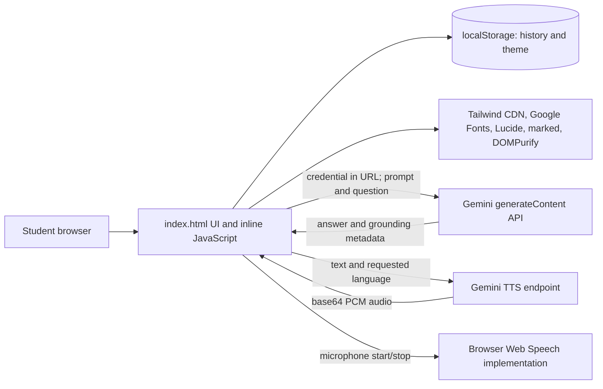

# MMCOE Vector system overview

Baseline date: 2026-09-07  
Baseline branch: `master`  
Baseline commit: `ec108647c202ea38007e27a7cd4ec87b37192376`  
Working branch: `fix/mmcoe-chatbot-reliability`

## What the system does

MMCOE Vector is a browser-only educational chatbot branded for Marathwada Mitra Mandal's College of Engineering (MMCOE). It presents a two-column chat interface, sends user questions to the Gemini `generateContent` REST API, asks Gemini to use Google Search, renders Markdown answers, offers Hindi and Marathi translation, generates English/Hindi/Marathi speech, accepts speech through the browser's Web Speech API, stores up to 50 question/answer records locally, and persists a light/dark theme.

The tracked application is currently one 2,597-line `index.html` plus `README.md`. There is no package manifest, source module tree, build script, test framework, Vercel manifest, or CI configuration at the baseline commit.

## Architecture



This is the *current* architecture, not the proposed repair architecture. The critical architectural problem is that the browser owns the Gemini credential and calls Gemini directly.

## Where features are implemented

| Feature | Current implementation |
|---|---|
| Layout, branding, themes, responsive styling | `index.html:15-658`; markup at `index.html:661-856` |
| Intro and ambient animations | `index.html:1133-1280` and `index.html:2347-2594` |
| Gemini endpoint and model configuration | `index.html:859-867` |
| Embedded MMCOE admission facts | `CONTEXT_GUIDE`, `index.html:901-937` |
| Assistant behavior and claimed capabilities | `SYSTEM_PROMPT`, `index.html:939-976` |
| Moderation | prompt at `index.html:978-984`; request at `index.html:1932-1957` |
| Google Search grounding request | `tools: [{ google_search: {} }]`, `index.html:2247-2252` |
| Answer and grounding response parsing | `index.html:2260-2283` |
| Markdown rendering and sanitization | dependency loader at `index.html:1243-1246`; rendering at `index.html:1787-1865` |
| Translation | prompt at `index.html:986-992`; requests at `index.html:1467-1516` and `index.html:1694-1785` |
| TTS and PCM/WAV conversion | `index.html:1300-1517` |
| Speech recognition and microphone lifecycle | `index.html:1959-2224` |
| History and local persistence | `index.html:876-878` and `index.html:1008-1131` |
| Theme persistence and ripple | `index.html:1519-1635` |
| Retries/loading | `index.html:1637-1655` and `index.html:1898-1930` |
| Quick replies and send path | `index.html:824-830` and `index.html:2226-2302` |
| Deployment description | README only; the repository contains no deployment configuration |

## Question-to-answer flow

1. The user types a question or a quick reply copies predefined text into the input.
2. `sendMessage()` immediately renders the user text and disables the input, send button, and microphone button.
3. `moderateContent()` sends the question to the same Gemini chat model with a moderation prompt. If that request errors, moderation returns `true` and fails open.
4. A second Gemini request sends only the current question, the complete system prompt, and the Google Search tool declaration. Earlier turns are not included.
5. The client reads only `candidates[0].content.parts[0].text`. It tries to read sources from `groundingMetadata.groundingAttributions`, although current Google documentation describes `groundingChunks` and `groundingSupports`.
6. `displayMessage()` parses Markdown with `marked`, sanitizes it with DOMPurify when both globals loaded, injects source links and utility controls, then appends the message.
7. The question and displayed answer (including API errors) are written to `localStorage`.
8. Translation and TTS controls make additional, independent Gemini requests. They are not part of a conversation object.

## Browser data and external data

Data retained in the browser:

- Up to 50 question/answer/timestamp records under `mmcoeVectorChatHistory` in `localStorage`.
- Theme choice under `theme` in `localStorage`.
- Transient response text, translations, generated audio blobs, and microphone state in memory/DOM.

Data sent externally:

- Every submitted question is sent to Google at least once for moderation and normally a second time for answering.
- Answer text is sent again to Google for each requested translation and TTS generation.
- Google Search grounding can cause Gemini to use public web search for the answer.
- Browser speech recognition can transmit audio to the browser vendor's recognition service; behavior depends on the browser implementation.
- The page loads code or assets from Tailwind's CDN, Google Fonts, unpkg, and cdnjs, exposing normal request metadata such as IP address and user agent to those providers.

The UI does not currently explain these data flows, retention, deletion scope, or third-party processing.

## Credentials

The Gemini credential is hard-coded in `index.html` and interpolated into query-string URLs. It is therefore present in Git history, delivered to every browser, visible in developer tools/network logs, and available to any site visitor. The baseline credential produced an invalid-authentication response locally and on the public site. Its value is intentionally omitted here.

Google's official guidance says API keys must not be committed or exposed in production browser/mobile code and recommends a backend proxy plus environment variables. Vercel environment variables are available to Functions at runtime and changes apply to later deployments, not already deployed versions.

References: [Google Gemini API key security](https://ai.google.dev/gemini-api/docs/generate-content/api-key), [Gemini API reference](https://ai.google.dev/api), [Vercel environment variables](https://vercel.com/docs/environment-variables), [Vercel Functions runtimes](https://vercel.com/docs/functions/runtimes).

## Dependency loading

- `cdn.tailwindcss.com` runs Tailwind's development CDN script in production.
- Inter is requested from Google Fonts.
- Lucide is loaded unpinned from `unpkg.com/lucide@latest`.
- After the roughly six-second intro, `marked@12.0.0` and DOMPurify `2.3.6` are injected dynamically from cdnjs. Initialization continues even if either script fails.
- The exported page includes a v0/Next development bridge and requests `/v0-runtime-dist.js`; the file is not in the repository and returned 404 locally.
- There is no lockfile, integrity metadata, Content Security Policy, dependency update mechanism, or reproducible local build.

## Implemented versus described

Actually implemented:

- Static chat UI, MMCOE branding, fixed quick replies, Markdown rendering, Google Search tool request, local history, translations, TTS request/PCM conversion, Web Speech recognition, theme persistence, and animation.

Implemented but presently non-functional or incomplete:

- Chat, moderation, translation, and TTS are blocked by the invalid credential.
- The configured TTS model name does not match Google's supported identifier.
- Current grounding metadata is not parsed, so citations are unlikely to display even with successful generation.
- History detail opens, but its back action cannot rebuild the removed list.
- “Follow-up conversation” is not implemented: each answer request contains only the latest user question.

Described or prompted but not implemented:

- “Exclusively trained,” “enterprise architecture/security,” verified accuracy, privacy compliance, guaranteed 60 fps, and “never-breaking” behavior are README claims without supporting implementation or evidence.
- The prompt says the assistant can accept documents, access Google Maps instantly, use an MMCOE academic-guidelines page, and always obtain current official information. There is no file-upload control, Maps tool/API, source allowlist, URL-context implementation, or correctness validator.
- Search grounding is present, but it is not a conventional institution-controlled RAG store and sources are neither restricted to official domains nor correctly attributed.

## Cloud settings not inspectable from this repository

- Which Vercel project/team owns the live domain, its framework preset, root/build/output settings, Git integration, branch rules, runtime version, environment variables, headers, analytics/logging, and deployment history.
- Whether the live site exactly corresponds to baseline commit `ec108647...` (the visible implementation matches, but deployment provenance is not exposed by the repository).
- Google Cloud/AI Studio project ownership, credential type, revocation state, API restrictions, enabled services, billing, quotas, safety/logging/data-use settings, or allowed origins.
- Whether Google Search grounding and preview TTS are enabled for the intended account/tier.
- Browser/OS microphone permission and Web Speech service behavior on real target devices.

## Current local run and deployment

Local run requires only a static HTTP server. The baseline used:

```text
python -m http.server 8000 --bind 127.0.0.1
```

Then open `http://127.0.0.1:8000/`. Opening the HTML as `file://` is not a reliable substitute because network and browser-security behavior differs.

There is no repository-defined build or deploy command. Vercel can serve a root static HTML/CSS/JS project with Framework Preset “Other,” no build command, and root output. That dashboard configuration is external to the repository. See [Vercel build configuration](https://vercel.com/docs/builds/configure-a-build).
